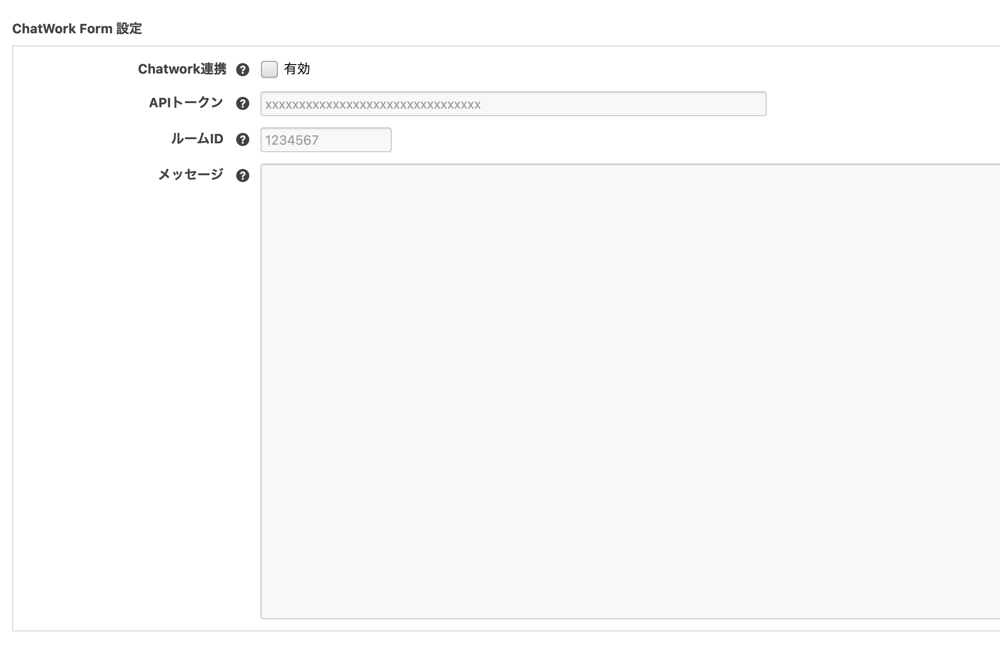

# ChatWork for a-blog cms

a-blog cms の 拡張アプリ「ChatWork for a-blog cms」を使うとフォームからデータが送信された段階でそのフォームのデータを加工し、ChatWork に通知することができます。例えばフォームから「資料請求」などがあれば「資料請求がありました。」などとChatWorkの好きなチャンネルに通知できます。

## 動作環境
- a-blog cms: >= Ver. 2.9.0

## ダウンロード
[ChatWork for a-blog cms](https://github.com/appleple/acms-chatwork/raw/master/build/chatwork.zip)

利用するためにはダウンロード後、/extension/pluginsに設置してください。

## 使い方
下の図のように、ChatWorkに送信したいメッセージを入力しておくことでお問い合わせがあった時などに、そのメッセージをChatWorkに送信することができます。
メッセージにはFormモジュールの変数と、グローバル変数を使用することができます。


## カスタマイズ手順
以下の3つのステップで a-blog cms と ChatWork を連携します。

1. ChatWorkへの登録
2. APIトークンの取得
3. a-blog cmsの拡張アプリ ChatWorkにAPIトークンを登録

### 1. ChatWorkへの登録
ChatWorkのアカウントをお持ちでない方は下記のURLにてアカウントを作成しましょう。ある程度の機能までは無料で使うことができます。 https://www.chatwork.com/

### 2. APIトークン の取得
https://www.chatwork.com/service/packages/chatwork/subpackages/api/token.php

パスワードを入力してAPIトークンを取得してください。


### 3. a-blog cmsの拡張アプリ ChatWork に APIトークン を登録

管理ページ > 拡張アプリより「拡張アプリ管理」のページに移動します。そのページより下の図のように ChatWork をインストールします。


インストール完了後は、管理ページ > フォーム > 連携したいフォームID より ChatWork の管理ページに移動します。その後、「APIトークン」という項目がありますので、その項目に先ほど覚えておいた APIトークン を入力します。
また「ルームID」には、下記のURLの*****の部分を入力します。

```
https://www.chatwork.com/#!rid*****
```

これでa-blog cmsと ChatWork を連携させる準備は整いました。


## 注意
config.server.phpでHOOKを有効にしておく必要があります。

```php
define('HOOK_ENABLE', 1);
```

